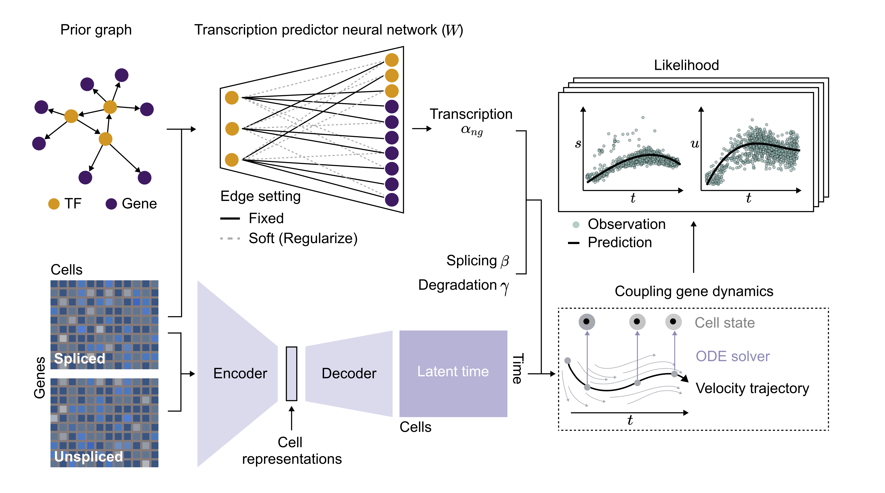

RegVelo: gene-regulatory-informed dynamics of single cells
==========================================================

**RegVelo** is an end-to-end framework to infer regulatory cellular dynamics through coupled splicing dynamics. 
See our `RegVelo manuscript`_ and `documentation`_ to learn more. 

Feel free to open an `issue`_ if you encounter a bug, need our help or just want to make a comment/suggestion.

RegVelo's key applications
--------------------------
- Estimzte RNA velocity governed by gene regulation.
- Infer latent time to indicate the cellular differentiation process.
- Estimate intrinsic and extrinsic velocity uncertainty `Gayoso et al. (2024)`_.
- Estimate regulon perturbation effects via CellRank framework (`Lange et al. (2022)`_, `Weiler et al. (2024)`_).

Getting started
---------------
We have `tutorials`_ to help you get started.

Installation
------------

You need to have Python 3.10 or newer installed on your system. 

There are several options to intall regvelo:

1. Install the latest release of `regvelo` from PyPI (TODO) via

.. code-block:: bash
  pip install regvelo

2. Install the latest development version via

.. code-block:: bash
  pip install git+https://github.com/theislab/regvelo.git@main

Citation
--------

If you find RegVelo useful for your research, please consider citing our work as:

.. code-block:: bibtex
  @article{wang2024regvelo,
    title={RegVelo: gene-regulatory-informed dynamics of single cells},
    author={Wang, Weixu and Hu, Zhiyuan and Weiler, Philipp and Mayes, Sarah and Lange, Marius and Wang, Jingye and Xue, Zhengyuan and Sauka-Spengler, Tatjana and Theis, Fabian J},
    journal={bioRxiv},
    pages={2024--12},
    year={2024},
    publisher={Cold Spring Harbor Laboratory}
  }

.. _RegVelo manuscript: https://www.biorxiv.org/content/10.1101/2024.12.11.627935v1
.. _Lange et al. (2022): https://www.nature.com/articles/s41592-021-01346-6
.. _Weiler et al. (2024): https://www.nature.com/articles/s41592-024-02303-9
.. _Gayoso et al. (2024): https://www.nature.com/articles/s41592-023-01994-w

.. _documentation: https://regvelo.readthedocs.io/en/latest/index.html
.. _tutorials: https://regvelo.readthedocs.io/en/latest/tutorials/index.html

.. _issue: https://github.com/theislab/regvelo/issues/new